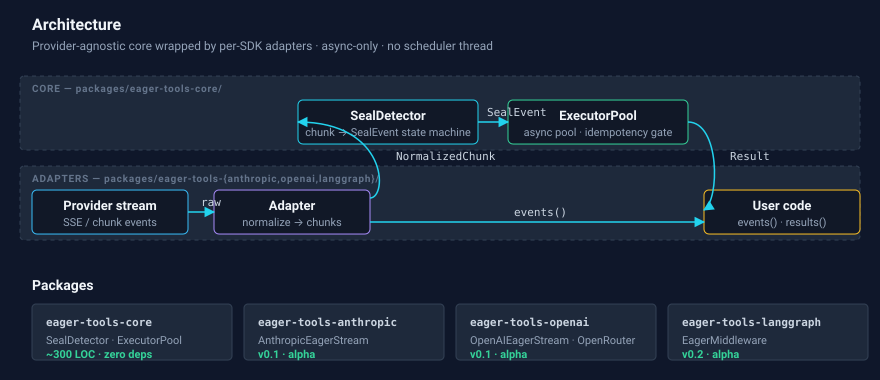

# eager-tools

> **Cut agent wall-clock latency by overlapping tool execution with LLM streaming.**
>
> A production-grade reference implementation of **eager tool calling** — the pattern that dispatches each tool the moment its block finishes streaming, not after `message_stop`.

[](https://pypi.org/project/eager-tools-core/)
[](./LICENSE)
[](https://github.com/eager-tools/eager-tools/actions)
[](./METHOD.md)

---

## The problem in one graph

<p align="center">
  
</p>

<details>
<summary>ASCII fallback</summary>

```
Classic parallel tool calling:
stream : [==================================]
tools  :                                     [===========]  ← idle during stream
total  :                                                    ← stream + max(tool)

Eager tool calling:
stream : [==================================]
tool A :   [=========]        ← fires mid-stream
tool B :       [=========]    ← fires mid-stream, overlaps A
tool C :           [=========]← fires at message_stop
total  : [==================================]               ← max(stream, max(tool))
```

</details>

Parallel tool calling overlaps tools with tools. **Eager tool calling overlaps tools with generation itself.**

## Benchmark headline

Synthetic harness — `make bench` reproduces locally, deterministic.
Across 16 workloads (3 → 15 tools), eager beats parallel by **1.20× – 1.50×** (median ~1.28×).
Parallel is the right baseline: modern frameworks (`langchain.agents.create_agent`,
OpenAI Agents SDK, Vercel AI SDK) already execute tool calls from one
assistant message concurrently. Eager's win comes from overlapping tools
with the *stream itself* — something parallel dispatch can't do.
Full table + repro details: [`bench/results.md`](./bench/results.md).

| Workload | Sequential | Parallel | **Eager** | Speedup vs parallel |
|----------|------------|----------|-----------|---------------------|
| 3-tool analytics | 4.90s | 3.50s | **2.90s** | 1.21× |
| 9-tool incident triage | 17.61s | 9.50s | **6.50s** | 1.46× |
| 15-tool ad campaign | 30.42s | 11.50s | **8.80s** | 1.31× |

> These are **lower bounds**. The synthetic stream removes network jitter,
> tail latency, and provider-side variance — the things that make eager
> dispatch shine in production. Run `make bench-live-anthropic` (or
> `-openai`) to spot-check against a real provider.

---

## 60-second quickstart

```bash
pip install eager-tools-core eager-tools-anthropic   # once published
# or, from source:
git clone https://github.com/eager-tools/eager-tools && cd eager-tools && make sync
```

```python
import asyncio
from anthropic import AsyncAnthropic
from eager_tools_anthropic import AnthropicEagerStream

class ReadFile:
    name = "read_file"
    idempotent = True  # safe to fire eagerly
    async def __call__(self, args):
        return open(args["path"]).read()

async def main():
    client = AsyncAnthropic()
    tools = {"read_file": ReadFile()}

    async with client.messages.stream(
        model="claude-sonnet-4-5",
        max_tokens=1024,
        tools=[{"name": "read_file", "description": "...", "input_schema": {...}}],
        messages=[{"role": "user", "content": "..."}],
    ) as raw:
        stream = AnthropicEagerStream(raw, tools=tools)
        async for event in stream.events():
            if event.kind == "tool_sealed":
                print(f"dispatched {event.tool_call.name} mid-stream")
        async for call, result in stream.results():
            print(f"{call.name} → {result}")

asyncio.run(main())
```

Five lines of integration. No LangGraph required. Works with any async
Anthropic stream — and with OpenAI / OpenRouter via `eager-tools-openai`.
Runnable variants in [`examples/`](./examples).

---

## Why this exists

Modern agent APIs — Anthropic, OpenAI, Bedrock — let the model emit multiple `tool_use` blocks in one assistant message and run them in parallel. That moves the tool phase from *sum* of durations to *max*. Good, but insufficient.

The **stream phase still happens first**. Tools still wait for `message_stop`. A four-second model stream followed by 2.5s of parallel tool execution is 6.5 seconds of wall clock. Eager tool calling makes it 4 seconds — the tools run *during* the stream, not after it.

See [`METHOD.md`](./METHOD.md) for the full mechanism: the seal event, the `tool_call_id` invariant, the runtime contract, and the edge cases.

---

## Project layout

```
eager-tools/
├── METHOD.md               ← provider-agnostic method reference
├── ROADMAP.md              ← OSS strategy, GTM, beyond-OSS ladders
├── NEXT.md                 ← v0.1 execution plan
├── TODO.md                 ← checkbox checklist
├── LICENSE                 ← MIT
├── Makefile                ← sync, test, lint, examples, bench
├── docs/
│   ├── concept.md                               ← what & why
│   ├── when-not-to-use.md                       ← when classic dispatch wins
│   └── rfc-streaming-tool-dispatch-protocol.md  ← cross-provider RFC
├── packages/
│   ├── eager-tools-core/        ← provider-agnostic SealDetector + ExecutorPool
│   ├── eager-tools-anthropic/   ← (v0.1) Anthropic SDK adapter
│   └── eager-tools-openai/      ← (v0.1) OpenAI / OpenRouter adapter
├── examples/                    ← 01_minimal, 02_anthropic, 03_openai, 04_cancel, 05_openrouter
├── bench/                       ← synthetic harness + checked-in results.md
└── .github/workflows/ci.yml
```

Future packages (`eager-tools-claude-agent`) live in the [Status](#status)
table, not yet in-tree.

<p align="center">
  
</p>

For the per-block mechanism (chunks → buffer → seal → dispatch), see
[`docs/diagrams/seal-mechanism.svg`](./docs/diagrams/seal-mechanism.svg).

## When NOT to use it

- **Fast tools (sub-50ms).** Seal/dispatch overhead exceeds the latency saved.
- **Sequentially dependent tools.** If tool B needs tool A's result, the model won't emit B until A returns — no pipeline opportunity.
- **Non-idempotent tools.** Payments, destructive commands, outbound messages. Route these to the classic path via `Tool.idempotent = False` for blanket denial, or via a per-call `gate` callable for case-by-case decisions with parsed args visible (e.g. allow `read_file` but not under `/etc/`). See [`docs/hitl.md`](./docs/hitl.md). The gate still gates the *eager* path; the underlying tool still runs at the framework's tool step for non-denied calls.
- **Non-streaming backends.** If your gateway buffers the full response, eager dispatch is impossible.

Long version with edge cases: [`docs/when-not-to-use.md`](./docs/when-not-to-use.md).

## Status

| Version | State | What's in it |
|---------|-------|--------------|
| v0.0.1 | scaffold | Core API shape locked, stubs + golden-trace tests |
| v0.1 | alpha — adapters + bench shipped | Core + Anthropic + OpenAI adapters, OpenRouter via the OpenAI adapter, 5 examples, synthetic bench |
| v0.2 | alpha — LangGraph adapter shipped | `eager-tools-langgraph` — `EagerMiddleware` for `langchain.agents.create_agent`, provider-agnostic via LangChain's `tool_call_chunks` |
| v0.3 | planned | Claude Agent SDK hook |

Follow progress in [`TODO.md`](./TODO.md). Behavior changes between versions
land in [`CHANGELOG.md`](./CHANGELOG.md) — read it before bumping
`eager-tools-core`, especially if you've implemented a custom
`ObservabilityHook`.

## Contributing

Adapter PRs welcome — LlamaIndex, AutoGen, Vercel AI SDK, any provider that exposes a streaming response with per-block identifiers. Start from `packages/eager-tools-core/` as the contract reference. See [`NEXT.md`](./NEXT.md) §3 for the extraction pattern.

Bug reports + design discussions happen in **GitHub Discussions** — issues are intentionally disabled to keep the signal-to-noise ratio high.

## Acknowledgements

This pattern was extracted from production at [CloudThinker](https://cloudthinker.io), where it cuts median agent task latency by 50%. Internal codename: *tool-call pipelining*. External name: *eager tool calling*.

Read the full production story: [*Eager Tool Calling: How We Made Agents 21× Faster on Long Tool Chains*](https://cloudthinker.io/blog/eager-tool-calling-21x-faster-agents).

## License

MIT — see [`LICENSE`](./LICENSE).
